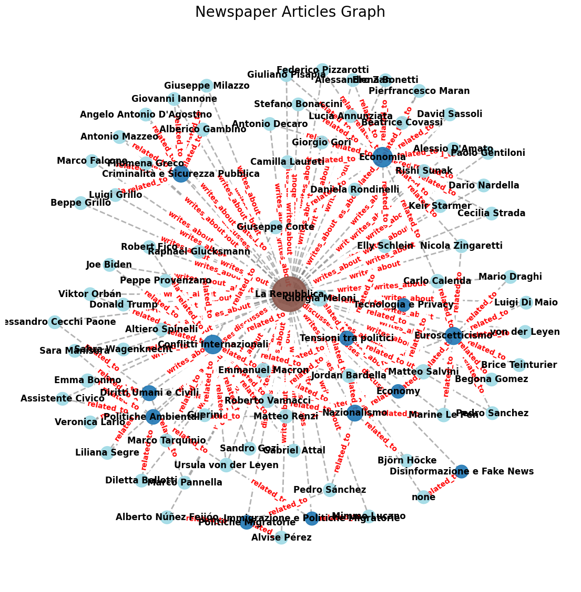

#  News Mapping

The library aims at giving a free instrument to obtain from Google News the coverage of newspapers and medias to model topics, get public persons mentioned and sources 
 for a certain topic in a structured way.
 

The projects maps in a multigraph structure topics, person and newspaper in the italian media coverage in the last 10 days before european elections 2024.

The process has the following structure:

- List of news articles by keyword(s) from Google News obtained using SerpAPI (100 API calls/month are free)
- URL scraping with requests and BeatifulSoup
- The corpus of the articles was cleaned with regex and LLM calls
- Topic Modelling performed with LLM calls to get topics
- Entit Recognition performed with LLM calls to get public persons mentioned in the articles

Example of News Mapping for the keyword "European Elections" on the main italian newspapers 

